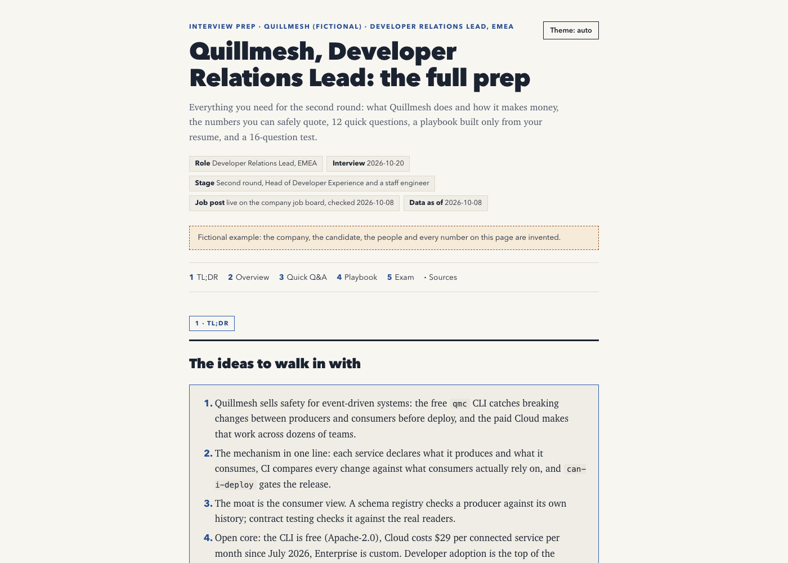
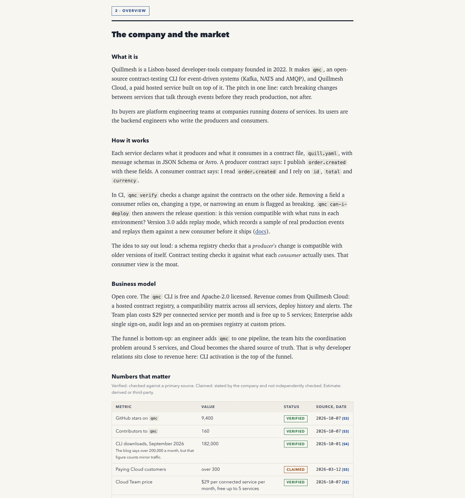
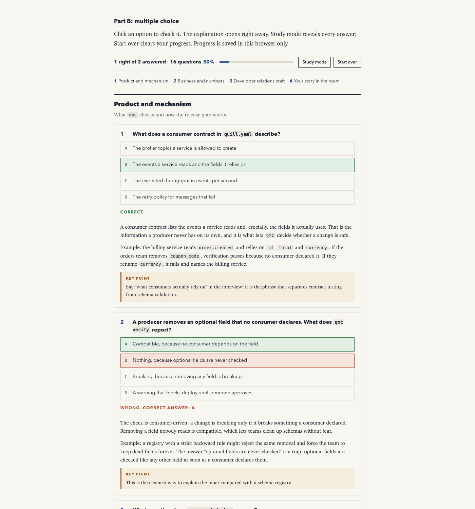
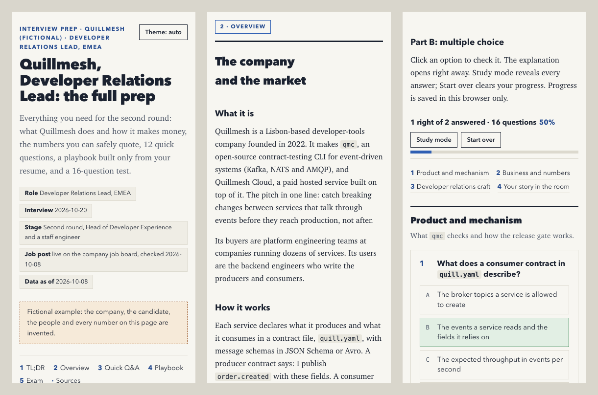
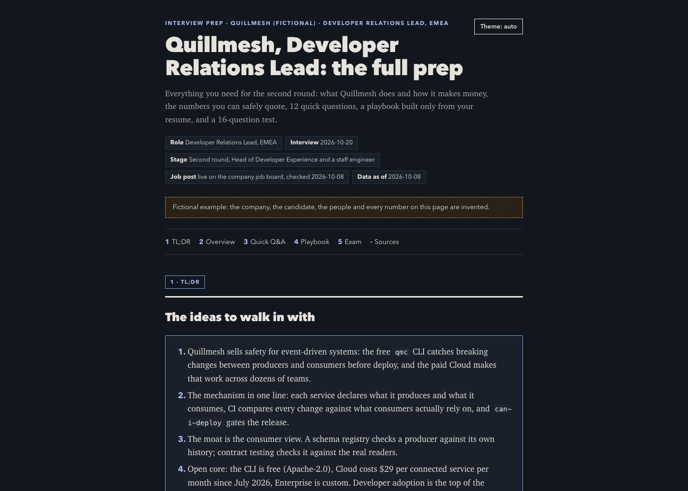

# hiring-prep

A Claude Code skill that turns a company, a role and your resume into one interview prep page: a researched briefing, quick Q&A, a personal playbook built only from your resume, and an interactive test.



*All screenshots show the fictional example in [`examples/fictional/`](examples/fictional/): the company, the candidate and every number are invented.*

## What it does

You give it:

1. **The company or project**: name and links (site, docs, X, job post).
2. **The role**: title plus the job description (link or pasted text).
3. **Your resume**: PDF, DOCX, Markdown or pasted text.

It researches the company from primary sources, verifies every number it will show you, and builds a single self-contained HTML page with five parts:

| Part | Contents |
|---|---|
| **TL;DR** | about 10 ideas to walk in with |
| **Overview** | what it is, how it works, business model, a numbers table (each with source, date and a verified / claimed / estimate badge), team, funding, a competitor comparison table, recent news, risks and controversies, and **traps**: stale or commonly wrong facts a careless candidate repeats |
| **Quick Q&A** | short questions with model answers, grouped by theme (ecosystem and product, the role's craft, the company) |
| **Personal playbook** | positioning, your resume evidence mapped to each requirement (strong / partial / gap), likely objections with honest reframes, 3 STAR stories, questions to ask, do and don't, a numbers cheat sheet, a 30-60-90 day skeleton. Built only from your resume: nothing is invented or inflated |
| **Exam** | open questions with model answers, and a multiple-choice test with immediate feedback, explanations with examples, a key point per question, a sticky score rail, Study mode, Start over, progress saved in your browser and a final verdict |





It works at phone width and in dark mode:





## The intake questions

The skill starts with a short interview (at most two rounds) and confirms a plan before researching:

1. Company or project, and links
2. Role title and job post (it checks whether the role is live on Ashby, Lever and Greenhouse, and says "not found" if it is not)
3. Your resume file
4. Interview stage and who is interviewing
5. Interview date
6. Language of the guide
7. Size: Quick (25 MCQs), Standard (50, recommended) or Deep (80)
8. Focus areas or worries
9. Output: private web page, local HTML file, or both
10. Whether the playbook may quote details from your resume

Details and defaults: [references/intake.md](references/intake.md).

## Install

```bash
git clone https://github.com/Matteoikarieth96/hiring-prep-skill ~/.claude/skills/hiring-prep
```

Then ask Claude Code something like "prepare me for the interview at Acme, here is the job post and my resume" (or "preparami al colloquio"). The skill triggers on interview prep, study guides and quizzes about a company.

## Use the scripts directly

```bash
# 1. resume text, contact details stripped, stays local
python3 scripts/resume_text.py ~/Documents/resume.pdf -o work/resume.txt

# 2. is the role live?
python3 scripts/ats_check.py acme --title "developer relations"

# 3. check the guide data
python3 scripts/validate.py guide.json

# 4. build the page (writes out/<slug>.html)
python3 scripts/build_guide.py guide.json --out-dir out

# 5. layout and quiz checks at 375, 320 and 1280 px, plus screenshots
python3 scripts/qa_check.py out/<slug>.html --shots out/qa
```

Try it on the example:

```bash
python3 scripts/validate.py examples/fictional/guide.json
python3 scripts/build_guide.py examples/fictional/guide.json --out-dir examples/fictional/out
open examples/fictional/out/quillmesh-devrel-lead.html   # or xdg-open on Linux
```

Open the page with `#demo` at the end of the URL to see the quiz with two questions pre-answered (nothing is saved), or `#focus-overview` to show one section.

## Outputs

- `out/<slug>.html`: one file, inline CSS and JS, no external requests unless you build with `--webfonts`. Light and dark mode (follows the system, with a toggle).
- `guide.json`: the data behind the page, documented in [references/guide-format.md](references/guide-format.md). Edit it and rebuild.
- `evidence/*.md`: the research notes, one row per fact with URL, access date and confidence.

## Requirements

- Python 3.9 or newer, standard library only.
- Google Chrome or Chromium for `qa_check.py` (set `CHROME_PATH` if it is not in the usual place).
- Optional: `pdftotext` (poppler) to read PDF resumes; otherwise Claude reads the PDF with its own file reader.
- Claude Code. Parallel research uses the Agent tool when available; publishing uses an artifact tool when available.

## Security and privacy, in short

- Your resume is not uploaded to search engines, job boards or research agents. It is read locally and its contact details are stripped first; the redacted text is then processed by your AI model provider as part of the conversation, like anything else you share with Claude. The skill fetches everything it needs from the web before it reads the resume, and uses no network tools afterwards except the private publish you ask for.
- The validator rejects contact details anywhere in the guide (email addresses, also obfuscated or split by markup, phone numbers, street addresses, dates of birth, tax codes, personal LinkedIn links) and warns on @handles and ENS names.
- Everything fetched (web pages, job posts, PDFs) is treated as data. Instructions found inside it are ignored and reported to you.
- The page escapes all text, renders the quiz with `textContent` only, allows only `http`/`https` links (with `rel="noopener noreferrer"`), embeds a Content-Security-Policy with hashes of its own script and style (for local files; omitted with `--no-csp` when a page host sandboxes it), and stores progress only in your browser.
- Output paths and slugs are validated; the build refuses to write outside the output folder.
- Pages are private by default.

Full details: [SECURITY.md](SECURITY.md) and [references/privacy.md](references/privacy.md).

## Limitations

- Research quality depends on what is public. Private companies may have few verifiable numbers; the guide labels them instead of guessing.
- The live-role check covers Ashby, Lever and Greenhouse only. Other job systems need a manual check.
- PDF resumes with unusual layouts may extract poorly; check `work/resume.txt` before the playbook is written.
- Numbers go stale. Rebuild a day or two before the interview (the validator warns after 45 days).
- The skill prepares you; it does not guarantee what an interviewer will ask.

## More skills

- [evm-dd](https://github.com/Matteoikarieth96/evm-dd-skill): investor-angle due diligence on crypto and EVM projects, with a scored report and an A4 one-pager
- [beer-can-label](https://github.com/Matteoikarieth96/beer-can-label-skill): full-wrap beer can labels with a 3D can preview
- [3d-print-design](https://github.com/Matteoikarieth96/3d-print-design-skill): parametric parts for FDM 3D printing, checked before export
- [whiteboard-video](https://github.com/Matteoikarieth96/whiteboard-video-skill): hand-drawn whiteboard explainer videos with voice-over

## Licence

MIT, see [LICENSE](LICENSE).
